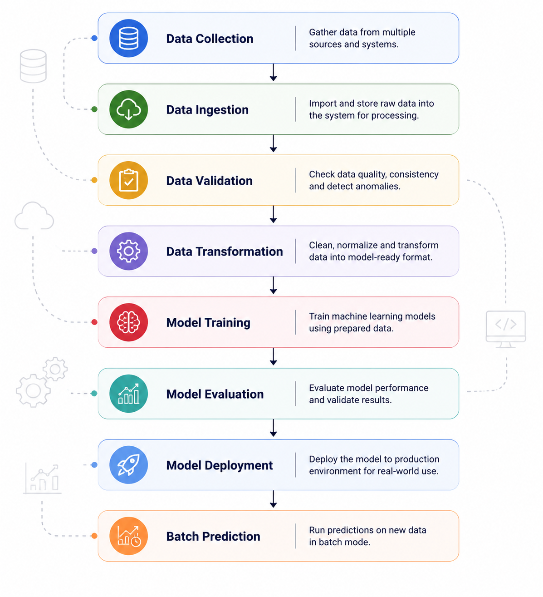

# 🔐 Network Security Threat Detection using Machine Learning

## 📌 Overview

**Network Security Threat Detection** is an end-to-end Machine Learning project designed to identify whether network traffic is **malicious or normal**.

The project implements a **production-ready ML pipeline** following industry-standard MLOps practices:

---

## 🚀 Key Features

This project follows modern **Machine Learning Engineering principles**:

- 🏗️ **Modular Pipeline Architecture**  
  Structured workflow for scalable ML development and deployment.

- ✅ **Data Validation**  
  Ensures data quality, consistency, and schema correctness before training.

- 📊 **Dataset Drift Detection**  
  Detects changes between training and incoming data distributions.

- 🤖 **Automated Model Training**  
  Complete pipeline for preprocessing, training, evaluation, and model saving.

- 📈 **MLflow Experiment Tracking**  
  Tracks experiments, metrics, parameters, and model versions.

- ⚡ **FastAPI Deployment**  
  Provides a lightweight REST API for real-time predictions.

- 📦 **Batch Prediction Pipeline**  
  Supports large-scale prediction on new network data.

---

## 🛠️ Technology Stack

| Category | Technologies |
|----------|-------------|
| Programming Language | Python |
| Machine Learning | Scikit-learn |
| API Framework | FastAPI |
| Experiment Tracking | MLflow |
| Database | MongoDB |
| Deployment | Docker, AWS |
| Data Processing | Pandas, NumPy |

---