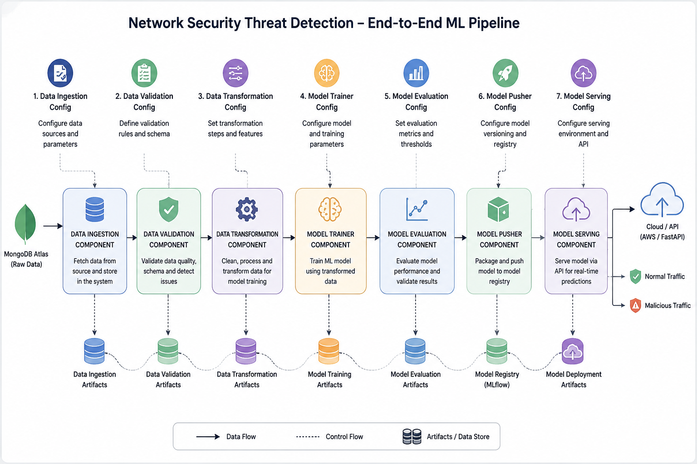
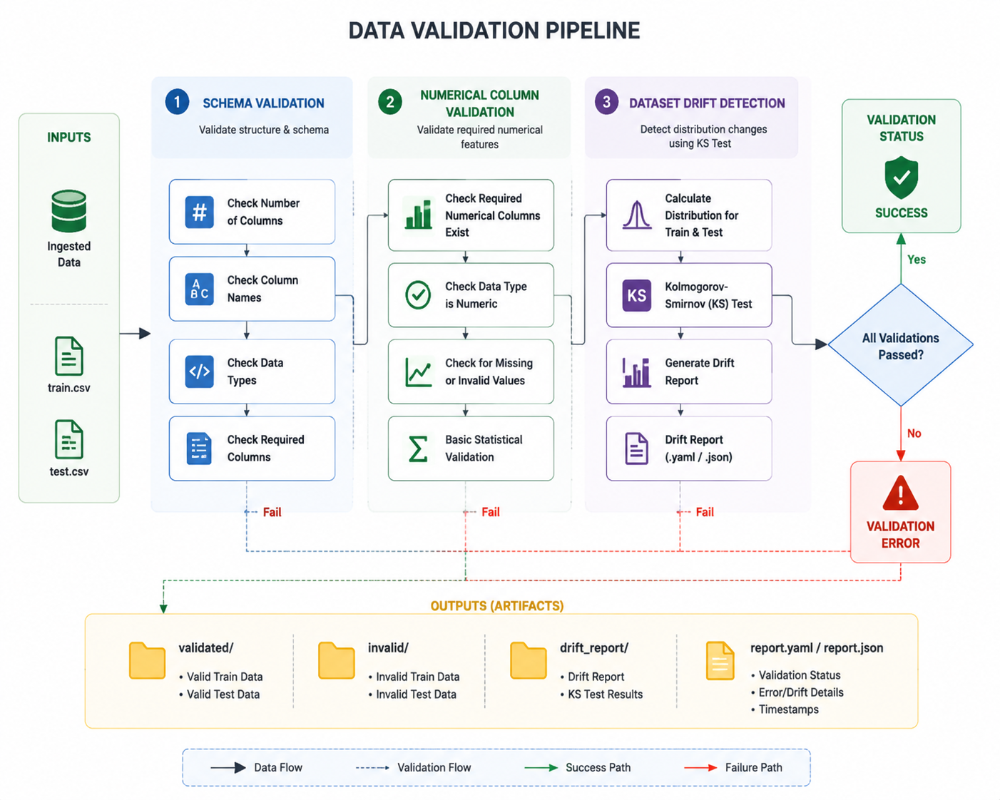

# 🔐 Network Security Threat Detection using Machine Learning

## 📌 Overview

**Network Security Threat Detection** is an end-to-end Machine Learning project designed to identify whether network traffic or websites represent **malicious (phishing)** or **normal** activity.

The project implements a **production-ready ML pipeline** following industry-standard MLOps practices:



---

## 🚀 Key Features

This project follows modern **Machine Learning Engineering & MLOps principles**:

- 🏗️ **Modular Pipeline Architecture** — Structured components for Ingestion, Validation, Transformation, Model Training, and Evaluation.
- 🔗 **Database Integration** — Automated extraction and ingestion from **MongoDB**.
- ✅ **Data Quality & Schema Validation** — Structural checking against strict schema definitions (`schema.yaml`).
- 📊 **Dataset Drift Detection** — Statistical distribution checking between training and incoming datasets using the **Kolmogorov-Smirnov (KS) Test**.
- 🧹 **Data Transformation** — KNN Imputer pipeline for missing values and NumPy array exports.
- 🤖 **Automated Model Selection & Tuning** — Hyperparameter grid search evaluating Random Forest, Decision Tree, Gradient Boosting, Logistic Regression, and AdaBoost.
- 📈 **MLflow & DagsHub Experiment Tracking** — Remote logging of metrics (F1, Precision, Recall), parameters, and model artifacts.
- ⚡ **FastAPI Web API** — REST API endpoints for triggerable retraining (`/train`) and interactive batch prediction (`/predict`) with HTML table visualization.

---

## 🛠️ Technology Stack

| Category | Technologies |
|----------|-------------|
| **Programming Language** | Python 3.10+ |
| **Machine Learning** | Scikit-learn, SciPy, NumPy, Pandas |
| **API Framework** | FastAPI, Uvicorn, Jinja2 |
| **Experiment Tracking** | MLflow, DagsHub |
| **Database** | MongoDB Atlas / PyMongo |
| **Deployment & Ops** | Docker, AWS |

---

## 🎯 Problem Statement

With the rapid increase in cyber threats and sophisticated attacks, detecting malicious network activity automatically has become a critical requirement for modern security systems.

This project analyzes network traffic and phishing feature vectors to classify connections into:

- ✅ **Normal / Legitimate Traffic (`0`)**
- 🚨 **Malicious / Phishing Traffic (`1`)**

The system provides an automated, scalable pipeline that ingests data, validates quality, trains candidate models, logs metrics, and serves predictions via FastAPI.

---

## 🧱 Pipeline Architecture & Components

### 1. 📥 Data Ingestion (`components/data_ingestion.py`)
- Connects to **MongoDB** (`NETWORKAI` database, `NetworkData` collection).
- Extracts raw network traffic records into pandas DataFrame format.
- Saves the full raw dataset into the Feature Store.
- Splits data into an **80/20 Train-Test split**.

```text
Artifacts/
└── data_ingestion/
    ├── feature_store/
    │   └── phisingData.csv
    └── ingested/
        ├── train.csv
        └── test.csv
```

---

### 2. ✅ Data Validation (`components/data_validation.py`)
- **Schema Validation**: Validates the total number of columns and verifies that all required numerical features exist according to `schema.yaml`.
- **Dataset Drift Detection**: Uses two-sample Kolmogorov-Smirnov (KS) tests to check feature distribution drift between training and testing splits.
- **Drift Report**: Exports a detailed `drift_report.yaml`.



```text
Artifacts/
└── data_validation/
    ├── valid_data/
    │   ├── train.csv
    │   └── test.csv
    ├── invalid_data/
    └── drift_report.yaml
```

---

### 3. 🧹 Data Transformation (`components/data_transformation.py`)
- Maps target labels (`-1` to `0` for legitimate, `1` for phishing).
- Fits a Scikit-Learn `Pipeline` utilizing `KNNImputer` ($k=3$) to impute missing feature values.
- Saves transformed train/test datasets as NumPy `.npy` arrays.
- Exports the preprocessor pipeline object to `final_model/preprocessor.pkl`.

```text
Artifacts/
└── data_transformation/
    ├── transformed/
    │   ├── train.npy
    │   └── test.npy
    └── transformed_object/
        └── preprocessor.pkl
```

---

### 4. 🤖 Model Training & Evaluation (`components/model_trainer.py`)
- Evaluates multiple classification models:
  - **Random Forest Classifier**
  - **Decision Tree Classifier**
  - **Gradient Boosting Classifier**
  - **Logistic Regression**
  - **AdaBoost Classifier**
- Performs **GridSearchCV** hyperparameter tuning.
- Selects the best performing model based on test evaluation metrics (F1 Score, Precision, Recall).
- Encapsulates preprocessor and classifier inside a custom `NetworkModel` wrapper.
- Exports the finalized pipeline model to `final_model/model.pkl`.

---

### 5. 📈 MLflow & DagsHub Experiment Tracking
- Logs metrics (`train_f1_score`, `test_f1_score`, `precision`, `recall`) and trained model artifacts to **DagsHub**.
- Enables remote experiment comparison and model versioning.

---

### 6. ⚡ API & Prediction Engine (`app.py`)
- Built with **FastAPI** and **Uvicorn**.
- Provides real-time prediction capabilities for incoming CSV batches.
- Visualizes prediction results as an interactive HTML table.

---

## 📂 Project Structure

```text
ML_Project/
├── .env                       # Environment variables (MongoDB connection URI)
├── app.py                     # FastAPI web application entry point
├── main.py                    # Local pipeline execution entry point
├── push_data.py               # Data extraction & MongoDB insertion script
├── requirements.txt           # Python dependencies
├── setup.py                   # Package setup configuration
├── Dockerfile                 # Containerization instructions
├── Network_Data/              # Raw data directory (phisingData.csv)
├── data_schema/               # Schema configuration (schema.yaml)
├── final_model/               # Production model artifacts (model.pkl, preprocessor.pkl)
├── templates/                 # HTML templates for FastAPI UI (table.html)
└── networksecurity/           # Main source package
    ├── cloud/                 # Cloud integration helpers
    ├── components/            # Pipeline components (Ingestion, Validation, Transformation, Trainer)
    ├── constant/              # Constants & schema paths
    ├── entity/                # Data structures (Config & Artifact entities)
    ├── exception/             # Custom exception handling
    ├── logging/               # Logging configuration
    ├── pipeline/              # Training pipeline coordinator
    └── utils/                 # General & ML helper functions
```

---

## ⚡ Quick Start & Usage

### 1. Prerequisite Setup

Clone the repository and set up a virtual environment:

```bash
git clone https://github.com/IshankPandey123/network-security-ml.git
cd network-security-ml

python -m venv venv
source venv/bin/activate   # On Windows: venv\Scripts\activate
pip install -r requirements.txt
```

### 2. Environment Configuration

Create a `.env` file in the project root:

```env
MONGO_DB_URL="mongodb+srv://<username>:<password>@cluster.mongodb.net/?retryWrites=true&w=majority"
```

### 3. Data Ingestion to MongoDB

Extract local CSV data and push it into MongoDB:

```bash
python push_data.py
```

### 4. Run the Training Pipeline

Execute the full ML training pipeline locally:

```bash
python main.py
```

---

## 🌐 Serving with FastAPI

Launch the FastAPI web service:

```bash
python app.py
```

Or run via Uvicorn directly:

```bash
uvicorn app:app --reload --host 0.0.0.0 --port 8000
```

### Available Endpoints

* 📄 **`GET /`**: Redirects to interactive Swagger API documentation (`http://localhost:8000/docs`).
* 🔄 **`GET /train`**: Triggers full pipeline re-training remotely.
* 📤 **`POST /predict`**: Upload a test dataset CSV to receive threat predictions formatted as an HTML table.

---

## 📄 License

This project is licensed under the MIT License - see the `LICENSE` file for details.
